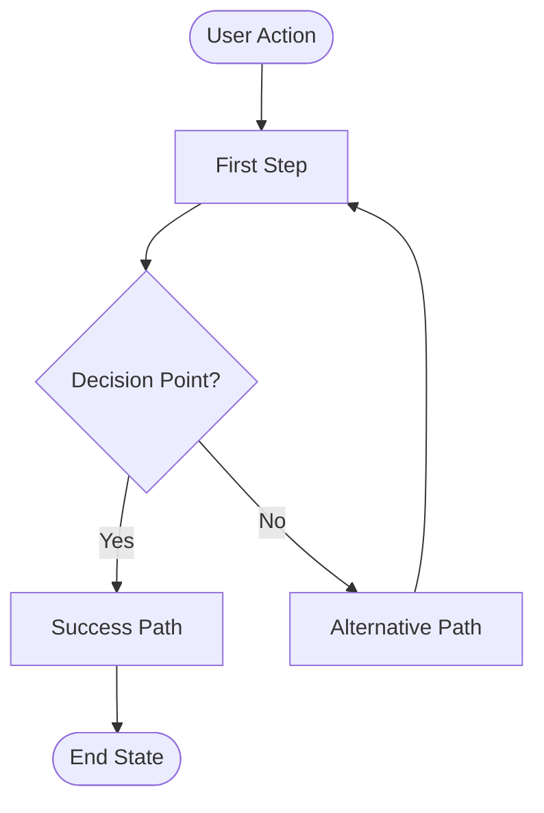
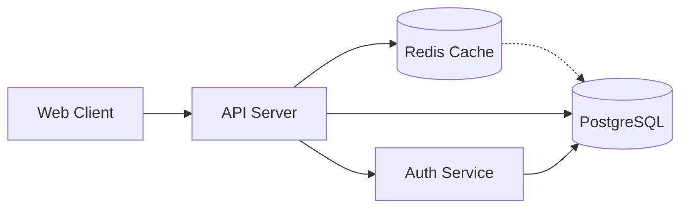
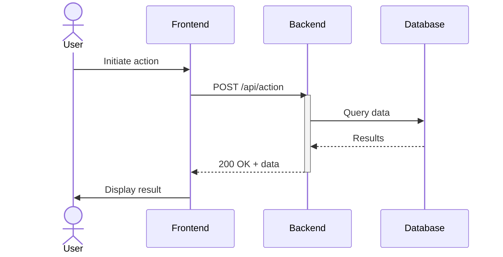
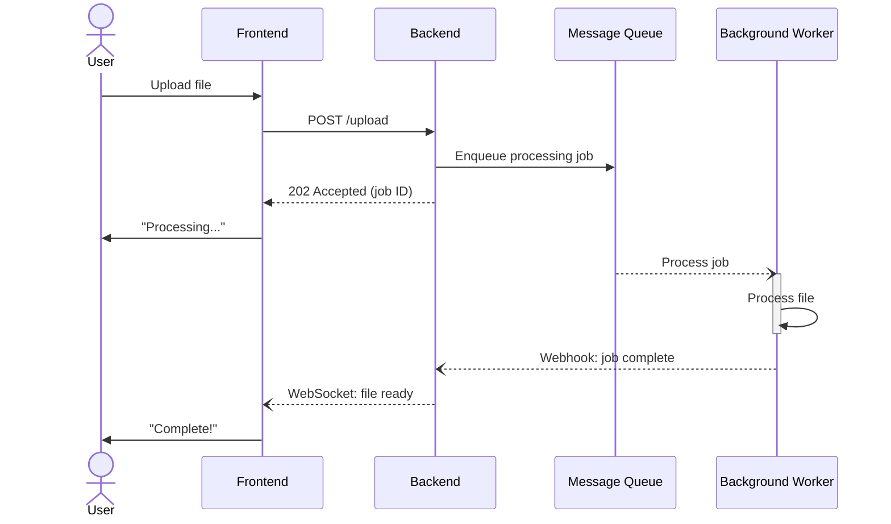
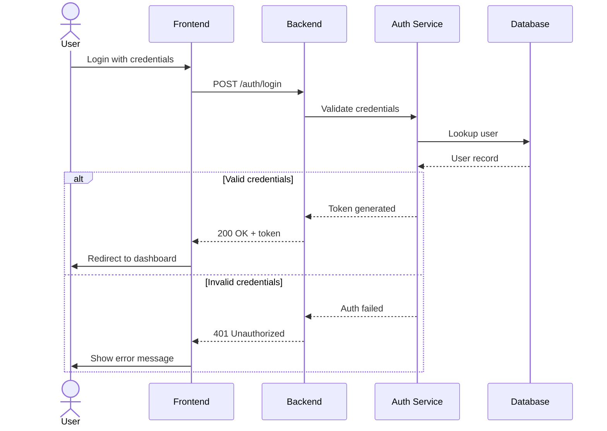
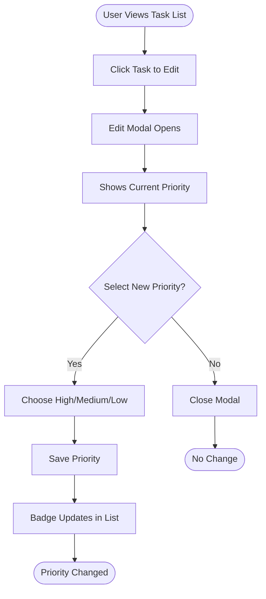
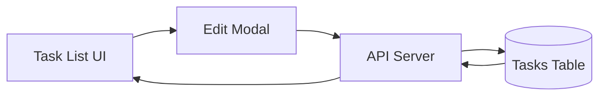

# PRD Generator

Create detailed Product Requirements Documents that are clear, actionable, and suitable for implementation.

---

## The Job

1. Receive a feature description from the user
2. Ask 3-5 essential clarifying questions (with lettered options)
3. Generate a structured PRD based on answers
4. Save to `tasks/prd-[feature-name].md`

**Important:** Do NOT start implementing. Just create the PRD.

---

## Step 1: Clarifying Questions

Ask only critical questions where the initial prompt is ambiguous. Focus on:

- **Problem/Goal:** What problem does this solve?
- **Core Functionality:** What are the key actions?
- **Scope/Boundaries:** What should it NOT do?
- **Success Criteria:** How do we know it's done?

### Format Questions Like This:

```
1. What is the primary goal of this feature?
   A. Improve user onboarding experience
   B. Increase user retention
   C. Reduce support burden
   D. Other: [please specify]

2. Who is the target user?
   A. New users only
   B. Existing users only
   C. All users
   D. Admin users only

3. What is the scope?
   A. Minimal viable version
   B. Full-featured implementation
   C. Just the backend/API
   D. Just the UI
```

This lets users respond with "1A, 2C, 3B" for quick iteration.

---

## Step 2: PRD Structure

Generate the PRD with these sections:

### 1. Introduction/Overview
Brief description of the feature and the problem it solves.

### 2. Goals
Specific, measurable objectives (bullet list).

### 3. User Stories
Each story needs:
- **Title:** Short descriptive name
- **Description:** "As a [user], I want [feature] so that [benefit]"
- **Acceptance Criteria:** Verifiable checklist of what "done" means

Each story should be small enough to implement in one focused session.

**Format:**
```markdown
### US-001: [Title]
**Description:** As a [user], I want [feature] so that [benefit].

**Acceptance Criteria:**
- [ ] Specific verifiable criterion
- [ ] Another criterion
- [ ] Typecheck/lint passes
- [ ] **[UI stories only]** Verify in browser using dev-browser skill
```

**Important:** 
- Acceptance criteria must be verifiable, not vague. "Works correctly" is bad. "Button shows confirmation dialog before deleting" is good.
- **For any story with UI changes:** Always include "Verify in browser using dev-browser skill" as acceptance criteria. This ensures visual verification of frontend work.

### 4. Functional Requirements
Numbered list of specific functionalities:
- "FR-1: The system must allow users to..."
- "FR-2: When a user clicks X, the system must..."

Be explicit and unambiguous.

### 5. Non-Goals (Out of Scope)
What this feature will NOT include. Critical for managing scope.

### 6. Design Considerations (Optional)
- UI/UX requirements
- Link to mockups if available
- Relevant existing components to reuse

### 7. Technical Considerations (Optional)
- Known constraints or dependencies
- Integration points with existing systems
- Performance requirements

### 8. System Diagrams (Conditional)
Visual diagrams for user flows and/or architecture. **Only include this section when diagrams are generated** (see Step 2.5 for worthiness criteria).

Each diagram includes:
- Purpose statement explaining what the diagram shows
- Mermaid diagram code block

### 9. Success Metrics
How will success be measured?
- "Reduce time to complete X by 50%"
- "Increase conversion rate by 10%"

### 10. Open Questions
Remaining questions or areas needing clarification.

---

## Step 2.5: Diagram Generation (Conditional)

Before finalizing the PRD, analyze if diagrams would add value. Diagrams are powerful for surfacing complexity and missing flows, but should only be included when they genuinely improve understanding.

### User Flow Diagram Worthiness

**Generate user flow diagram IF:**
- 3+ sequential steps in user journey, OR
- 2+ decision points (conditional branches), OR
- Non-obvious navigation flow (branching paths, error recovery)

**SKIP if:**
- Single linear action ("click button, form submits")
- Flow described clearly in 1-2 sentences
- Only one meaningful user action with obvious result

### Architecture Diagram Worthiness

**Generate architecture diagram IF:**
- 3+ components/services mentioned in Technical Considerations, OR
- External integrations (APIs, databases, third-party services), OR
- Complex data flow between components

**SKIP if:**
- Single component/page
- Standard CRUD with obvious architecture
- All components clearly described in text

### Sequence Diagram Worthiness

**Generate sequence diagram IF:**
- 3+ services/participants communicate in a flow, OR
- Async operations involved (webhooks, message queues, background jobs, WebSocket push), OR
- Complex request-response chains where timing/order matters (auth flows, payment processing, multi-step API orchestration)

**SKIP if:**
- Simple single API call (request-response obvious)
- No external services or async operations
- Interaction already clear from architecture diagram
- Only 2 participants (use text description instead)

### Complexity Limits

To keep diagrams readable and useful:
- **User flows:** Maximum 10 nodes. If requirements suggest more, either split into multiple diagrams or skip entirely (feature too complex to visualize effectively)
- **Architecture:** Maximum 8 nodes. Focus on primary components, not every service detail
- **Sequences:** Maximum 7 participants. Sequence diagrams with more participants become horizontal scroll nightmares

If a feature exceeds these limits, either split into multiple focused diagrams or skip entirely. Exceeding limits signals the PRD may need to be split into smaller features.

### Diagram Templates

Use these proven templates to avoid common Mermaid syntax errors.

#### User Flow Template (flowchart TD - Top Down)



**Shape conventions:**
- `([rounded])` for start/end points (user initiates/completes action)
- `{diamond}` for decision points (yes/no, conditional branches)
- `[rectangle]` for action steps (what happens)
- `-->|label|` for labeled connections (conditional branches)

#### Architecture Template (flowchart LR - Left to Right)



**Shape conventions:**
- `[rectangle]` for services/servers/components
- `[(cylinder)]` for databases and data stores
- `-->` for primary data flow
- `-.->` for optional/cache-miss/fallback paths

#### Sequence Diagram Templates (sequenceDiagram)

Sequence diagrams use different syntax than flowcharts. Use `sequenceDiagram` directive, `actor` for humans, and `participant` for services.

**Arrow conventions:**
- `->>` for synchronous request (waits for response)
- `-->>` for synchronous response (returning)
- `--)` for async message (fire and forget, webhook, queue)

##### Basic Sequence (Sync Request-Response)



**Key patterns:**
- `actor` for human users, `participant X as Label` for services
- `activate`/`deactivate` shows processing duration
- Pair requests with responses for sync calls

##### Async Operations (Queue, Webhooks)



**Key patterns:**
- `--)` for async messages (no response expected)
- No response arrow for fire-and-forget async
- WebSocket push shown as async from API to UI

##### Auth Flow with Alt/Else (Conditional Paths)



**Key patterns:**
- `alt`/`else`/`end` for conditional flows
- Show both success and failure paths
- `end` keyword closes the alt block

### Character Escaping Rules

To prevent Mermaid syntax errors:

1. **Node IDs:** Use alphanumeric characters and underscores only. Avoid starting IDs with lowercase 'o' or 'x' (creates circle/cross edges).
   - Good: `User_Login`, `API_Server`, `DB_Primary`
   - Bad: `open-modal`, `x-validate`, `user.login`

2. **Reserved keywords:** Capitalize 'end' in labels (`End`, `END`, never lowercase `end`)

3. **Special characters in labels:** Wrap the entire label in quotes when using `()`, `[]`, `#`, `:`, or other special characters:
   ```mermaid
   A["User Profile (Settings)"]
   B["Email [validated]"]
   C["Tags: #urgent"]
   ```

4. **Stick to classic syntax:** Use v10-compatible shapes for maximum GitHub compatibility. Avoid v11.3.0+ generalized shape syntax.

#### Sequence Diagram Escaping Additions

5. **Sequence reserved keywords:** Avoid these as participant names or message text:
   - `end`, `loop`, `alt`, `else`, `opt`, `par`, `and`, `critical`, `option`, `break`, `rect`, `note`
   - If needed, wrap in quotes: `participant "End User" as EndUser`

6. **Special characters in aliases:**
   ```mermaid
   participant API as "API Server (v2)"
   participant DB as "PostgreSQL [Primary]"
   ```

7. **Line breaks in notes:**
   ```mermaid
   Note over API,DB: Multi-line note<br/>with line break
   ```

### Section Placement Instructions

When diagrams pass worthiness criteria:

1. Insert "## System Diagrams" section after Technical Considerations, before Success Metrics
2. Include "### Diagram Judgment" subsection FIRST, explaining why each diagram type was included or skipped
3. Include a purpose statement: "This section visualizes the {user journey / system architecture / service interactions} to clarify {what aspect}."
4. Add a subsection title for each diagram type included
5. Include the Mermaid code block with proper syntax

**Only include the System Diagrams section when at least one diagram is generated.** The section starts with diagram judgment notes explaining inclusion decisions, followed by the actual diagrams.

### Worthiness Analysis Process

When generating a PRD:

1. **After writing Functional Requirements:** Count sequential steps user must complete. Count decision points (if/else, conditional paths).

2. **After writing Technical Considerations:** Count distinct components/services mentioned. Check for external integrations.

3. **Check for service communication patterns:** Count services that exchange messages. Check for async operations (webhooks, queues, background jobs, WebSocket).

4. **Apply thresholds:**
   - 3+ steps OR 2+ decisions → generate user flow
   - 3+ components OR external integration → generate architecture
   - 3+ services communicate OR async operations involved → generate sequence

5. **If thresholds met:** Generate diagram using templates above. Replace placeholders with actual names from requirements. Escape special characters.

6. **Verify before including:**
   - Does diagram add value beyond the text?
   - Is it under complexity limits?
   - Would a junior developer find it helpful?

### Diagram Judgment Notes

Every PRD with a System Diagrams section must include a "Diagram Judgment" subsection explaining why each diagram type was included or skipped. This provides transparency to PRD readers and documents the analysis for future updates.

**Format:**
```markdown
### Diagram Judgment

This PRD includes the following diagrams based on complexity analysis:

- **User Flow:** [Included/Skipped] - [specific reason with numbers]
- **Architecture:** [Included/Skipped] - [specific reason with numbers]
- **Sequence:** [Included/Skipped] - [specific reason with numbers]
```

**Good judgment notes cite specific triggers:**
- "Included - 4 sequential steps with 2 decision points (file upload workflow)"
- "Included - 5 components interact (Frontend, API, Queue, Worker, DB)"
- "Skipped - No async operations or multi-service choreography"
- "Skipped - Only 2 participants, interaction clear from text"

**Bad judgment notes are vague:**
- "Included for clarity" (why?)
- "Skipped because simple" (what makes it simple?)

Always cite the specific worthiness trigger (numbers, patterns) rather than generic statements.

---

## Writing for Junior Developers

The PRD reader may be a junior developer or AI agent. Therefore:

- Be explicit and unambiguous
- Avoid jargon or explain it
- Provide enough detail to understand purpose and core logic
- Number requirements for easy reference
- Use concrete examples where helpful

---

## Output

- **Format:** Markdown (`.md`)
- **Location:** `tasks/`
- **Filename:** `prd-[feature-name].md` (kebab-case)

---

## Example PRD

```markdown
# PRD: Task Priority System

## Introduction

Add priority levels to tasks so users can focus on what matters most. Tasks can be marked as high, medium, or low priority, with visual indicators and filtering to help users manage their workload effectively.

## Goals

- Allow assigning priority (high/medium/low) to any task
- Provide clear visual differentiation between priority levels
- Enable filtering and sorting by priority
- Default new tasks to medium priority

## User Stories

### US-001: Add priority field to database
**Description:** As a developer, I need to store task priority so it persists across sessions.

**Acceptance Criteria:**
- [ ] Add priority column to tasks table: 'high' | 'medium' | 'low' (default 'medium')
- [ ] Generate and run migration successfully
- [ ] Typecheck passes

### US-002: Display priority indicator on task cards
**Description:** As a user, I want to see task priority at a glance so I know what needs attention first.

**Acceptance Criteria:**
- [ ] Each task card shows colored priority badge (red=high, yellow=medium, gray=low)
- [ ] Priority visible without hovering or clicking
- [ ] Typecheck passes
- [ ] Verify in browser using dev-browser skill

### US-003: Add priority selector to task edit
**Description:** As a user, I want to change a task's priority when editing it.

**Acceptance Criteria:**
- [ ] Priority dropdown in task edit modal
- [ ] Shows current priority as selected
- [ ] Saves immediately on selection change
- [ ] Typecheck passes
- [ ] Verify in browser using dev-browser skill

### US-004: Filter tasks by priority
**Description:** As a user, I want to filter the task list to see only high-priority items when I'm focused.

**Acceptance Criteria:**
- [ ] Filter dropdown with options: All | High | Medium | Low
- [ ] Filter persists in URL params
- [ ] Empty state message when no tasks match filter
- [ ] Typecheck passes
- [ ] Verify in browser using dev-browser skill

## Functional Requirements

- FR-1: Add `priority` field to tasks table ('high' | 'medium' | 'low', default 'medium')
- FR-2: Display colored priority badge on each task card
- FR-3: Include priority selector in task edit modal
- FR-4: Add priority filter dropdown to task list header
- FR-5: Sort by priority within each status column (high to medium to low)

## Non-Goals

- No priority-based notifications or reminders
- No automatic priority assignment based on due date
- No priority inheritance for subtasks

## Technical Considerations

- Reuse existing badge component with color variants
- Filter state managed via URL search params
- Priority stored in database, not computed
- Task List UI component renders priority badges
- API Server handles priority updates
- Tasks Table stores priority field

## System Diagrams

### Diagram Judgment

This PRD includes the following diagrams based on complexity analysis:

- **User Flow:** Included - 6 sequential steps with 2 decision points (priority change workflow with validation)
- **Architecture:** Included - 4 components interact (Task List UI, Edit Modal, API Server, Tasks Table)
- **Sequence:** Skipped - Simple request-response pattern with no async operations or multi-service communication

This section visualizes the task priority user journey and system architecture to clarify data flow and UI interactions.

### User Flow: Changing Task Priority

This diagram shows the user journey for changing a task's priority, including the modal interaction and persistence flow.



### System Architecture: Priority Feature Components

This diagram illustrates how the priority feature components interact, from the UI layer through the API to the database.



## Success Metrics

- Users can change priority in under 2 clicks
- High-priority tasks immediately visible at top of lists
- No regression in task list performance

## Open Questions

- Should priority affect task ordering within a column?
- Should we add keyboard shortcuts for priority changes?
```

---

## Checklist

Before saving the PRD:

- [ ] Asked clarifying questions with lettered options
- [ ] Incorporated user's answers
- [ ] User stories are small and specific
- [ ] Functional requirements are numbered and unambiguous
- [ ] Non-goals section defines clear boundaries
- [ ] Saved to `tasks/prd-[feature-name].md`

### Diagram Verification (when applicable)

- [ ] If user journey has 3+ steps or 2+ decisions, user flow diagram included
- [ ] If feature has 3+ components or external integrations, architecture diagram included
- [ ] If 3+ services communicate or async operations involved, sequence diagram included
- [ ] Diagram Judgment subsection included explaining why each diagram type included or skipped
- [ ] Diagrams use proper Mermaid syntax (alphanumeric node IDs with underscores, no lowercase 'o'/'x' starts)
- [ ] Special characters in labels wrapped in quotes
- [ ] Diagrams render correctly in markdown preview (verify before saving)
- [ ] Each diagram has purpose statement explaining what it shows
- [ ] Diagrams stay within complexity limits (max 10 nodes for flows, max 8 for architecture, max 7 participants for sequences)
