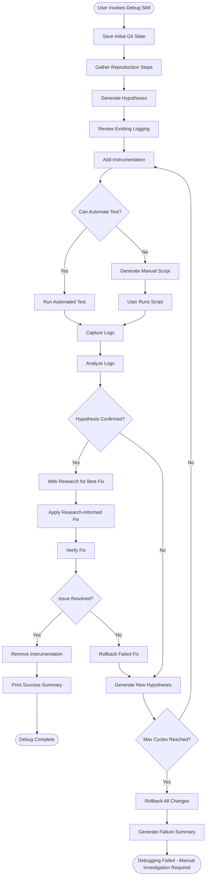
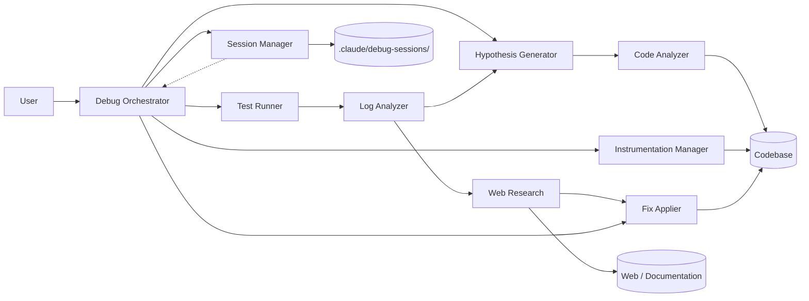
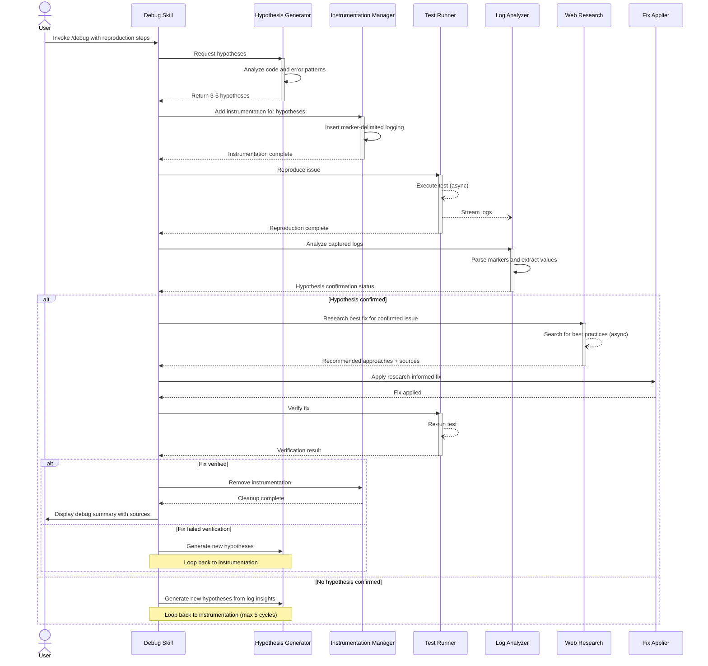

# PRD: Claude Code Debug Skill

## Claude Code Skill Context

This PRD describes a **Claude Code Skill**—a reusable, shareable workflow that extends Claude Code's capabilities across all projects. Claude Code Skills are invoked via slash commands (e.g., `/debug`) and provide specialized functionality that can be used in any codebase where Claude Code is available.

**What is a Claude Code Skill?**
- Skills are pre-built workflows that extend Claude Code with specialized capabilities
- Invoked via slash commands in the Claude Code CLI or IDE integrations
- Available globally across all projects once installed
- Can be shared and reused by the community
- Documentation: https://code.claude.com/docs/en/skills

This debug skill will be **globally available** to all projects using Claude Code, not limited to a single codebase.

**Implementation Note: LLM Template Design Project**

This is an **LLM template design project**, not a traditional software development project. Implementation involves:

- Designing the prompt workflow that guides Claude Code through the debugging cycle
- Creating structured prompts for each phase (intake, hypothesis generation, instrumentation, analysis, etc.)
- Defining the skill's SKILL.md file with instructions and examples
- Testing the skill template against various debugging scenarios

**No traditional code implementation is required.** The "implementation" is the skill template itself—a carefully designed set of instructions that Claude Code follows to perform systematic debugging. Think of this as prompt engineering at scale, creating a reusable debugging methodology that works across all programming languages and project types.

**No Tests Required:** Since this is a template design project, no unit tests, integration tests, or end-to-end tests are required. Validation happens through real-world usage scenarios where the skill template is applied to actual debugging tasks.

## Introduction

Add a systematic debugging skill to Claude Code that mimics Cursor's debug mode, providing hypothesis-driven debugging with automated instrumentation, reproduction, and fix verification. This Claude Code Skill guides users through a structured debugging cycle: gather reproduction steps, generate hypotheses across multiple files (frontend, backend, database), instrument code with targeted logging, reproduce the issue (handling both deterministic and flaky tests), analyze logs, research current best practices for confirmed issues, apply complete research-informed fixes (no partial fixes), and verify solutions. Each hypothesis is tested against a clean baseline—if a fix fails verification, only the fix is rolled back while instrumentation remains for the next hypothesis attempt. Debug sessions are persisted during active investigation and cleaned up after resolution. If max iterations are reached without successful fix, the skill rolls back all changes and generates a comprehensive failure summary for human handoff. This approach transforms ad-hoc debugging into a methodical, traceable process that works across architectural boundaries, leverages the latest community knowledge, maintains clean state between hypothesis attempts, and never leaves the codebase in a broken state.

## Goals

t- **Global Availability**: Provide this debug skill as a Claude Code Skill available to all projects, not limited to a single codebase
- Provide a systematic, repeatable debugging workflow for all issue types (runtime errors, logic bugs, performance)
- Automate hypothesis generation based on code analysis and error patterns, spanning multiple files and architectural layers
- Instrument code with language-appropriate logging that's easy to locate and remove across all affected files
- Support both automated testing and manual reproduction paths, including flaky/intermittent issue handling
- Research current best practices and workarounds after hypothesis confirmation to ensure robust, modern fixes
- Apply complete fixes that fully resolve root causes (no partial fixes or symptom band-aids)
- Verify fixes before cleanup to prevent false positives
- Rollback failed fixes before testing new hypotheses to maintain clean baseline (no stacking failed fixes)
- Generate actionable summaries documenting root cause, research findings, applied fix, and source citations
- Persist debug session state during active investigation to enable resume on interruption
- Use local logging mechanisms only (no external service dependencies)
- Gracefully handle failure cases: rollback all changes and generate comprehensive failure summary when max iterations reached

## User Stories

### US-001: Skill invocation and issue intake
**Description:** As a user, I want to invoke the debug skill and provide reproduction steps so the system understands what to investigate.
**Acceptance Criteria:**
- [ ] Skill invoked via `/debug` command
- [ ] Prompts user for reproduction steps (what actions trigger the issue)
- [ ] Prompts for expected vs actual behavior
- [ ] Prompts for relevant error messages or stack traces
- [ ] Stores issue context in structured format for hypothesis generation

### US-002: Automated hypothesis generation
**Description:** As a user, I want the system to automatically generate potential root causes so I don't have to manually theorize every possibility.

**Acceptance Criteria:**
- [ ] Analyzes code in affected area using AST parsing
- [ ] Generates 3-5 ranked hypotheses based on error patterns, code structure, and common bug categories
- [ ] Each hypothesis includes specific line ranges to investigate across multiple files (frontend, backend, database)
- [ ] Hypotheses cover different failure modes (null reference, race condition, incorrect logic, cross-service communication)
- [ ] Calculates confidence scores internally (not shown to user)

### US-003: Code instrumentation review and planning
**Description:** As a developer, I want to review existing logging before adding instrumentation so I don't duplicate or interfere with current logging.

**Acceptance Criteria:**
- [ ] Scans affected files for existing logging statements
- [ ] Identifies logging framework in use (or lack thereof)
- [ ] Reports current logging coverage in affected code paths
- [ ] Plans instrumentation locations for each hypothesis
- [ ] Shows instrumentation plan before applying changes

### US-004: Language-adaptive instrumentation insertion
**Description:** As a user, I want logging added in idiomatic style for my language/framework so instrumentation fits naturally and doesn't break the code.

**Acceptance Criteria:**
- [ ] Detects language from file extensions and syntax
- [ ] Uses language-appropriate logging (Python logging, console.log for JS, fmt.Println for Go, etc.)
- [ ] Adds unique marker comments before/after each instrumentation block (e.g., `// DEBUG_HYPOTHESIS_1_START`)
- [ ] Logs relevant variable values, execution paths, and timing data
- [ ] Escapes special characters in logged values to prevent log injection
- [ ] Preserves original indentation and code style

### US-005: Issue reproduction with automated or manual testing
**Description:** As a user, I want the system to reproduce the issue automatically if possible, or guide me through manual reproduction if not.

**Acceptance Criteria:**
- [ ] Attempts to identify existing test suite (pytest, jest, go test, etc.)
- [ ] If reproduction steps are automatable, generates test case that triggers the issue
- [ ] If automation not feasible, generates step-by-step manual test script
- [ ] Executes automated test or prompts user to run manual script
- [ ] Captures all log output during reproduction
- [ ] Stores logs for analysis

### US-006: Log analysis and hypothesis confirmation
**Description:** As a user, I want the system to analyze logs and tell me which hypothesis (if any) was confirmed so I know what to fix.

**Acceptance Criteria:**
- [ ] Parses captured logs for hypothesis marker comments
- [ ] Extracts variable values, execution flow, and timing data
- [ ] Compares actual vs expected values for each hypothesis
- [ ] Marks hypothesis as confirmed, rejected, or inconclusive
- [ ] Displays confirmed hypothesis with supporting log evidence
- [ ] If no hypothesis confirmed, proposes 2-3 new hypotheses based on log insights

### US-007: Web research for confirmed hypothesis
**Description:** As a developer, I want the system to research the confirmed root cause online so the fix uses current best practices and known workarounds.

**Acceptance Criteria:**
- [ ] Triggers web research after hypothesis confirmation, before fix generation
- [ ] Searches for: confirmed issue pattern, error message, language/framework-specific solutions
- [ ] Queries include: "best practice", "workaround", "fix", library version if applicable
- [ ] Identifies: common solutions, security implications, deprecated approaches to avoid
- [ ] Summarizes findings: recommended approach, alternative solutions, known gotchas
- [ ] Cites sources for recommended approach

### US-008: Fix application with research-informed solution
**Description:** As a developer, I want the system to apply a complete fix using research-backed best practices so the solution is robust, current, and fully resolves the issue (no partial fixes).

**Acceptance Criteria:**
- [ ] Generates COMPLETE fix based on confirmed hypothesis AND web research findings (no partial fixes)
- [ ] Prioritizes researched best practices over naive solutions
- [ ] Fix addresses the root cause entirely, not just symptoms
- [ ] Explains what the fix does, why it solves the issue completely, and which approach was chosen
- [ ] References sources if fix uses specific technique from research
- [ ] Applies fix to affected files
- [ ] Preserves instrumentation for verification step
- [ ] Commits fix with descriptive message referencing root cause and approach

### US-009: Fix verification and iteration
**Description:** As a user, I want to verify the fix actually works before cleaning up instrumentation so I don't prematurely close the investigation.

**Acceptance Criteria:**
- [ ] Re-runs automated test or prompts manual reproduction
- [ ] Compares new logs to original issue logs
- [ ] If issue resolved: proceeds to cleanup
- [ ] If issue persists: rolls back the failed fix (but keeps instrumentation in place)
- [ ] Verifies fix rollback: failed fix code removed, instrumentation markers still present
- [ ] After rollback, returns to hypothesis generation with new context (failure logs from attempted fix)
- [ ] Limits iteration cycles to prevent infinite loops (max 5 cycles)

### US-010: Instrumentation cleanup
**Description:** As a developer, I want all debug logging removed after fix verification so the codebase stays clean.

**Acceptance Criteria:**
- [ ] Searches for all hypothesis marker comments
- [ ] Removes logging statements and markers added during debugging
- [ ] Preserves original code structure and formatting
- [ ] Verifies no orphaned imports or variables remain
- [ ] Runs linter/formatter if project has them configured
- [ ] Commits cleanup separately from fix commit

### US-011: Debug summary generation
**Description:** As a user, I want a concise summary of what caused the issue and how it was fixed so I can learn from the process.

**Acceptance Criteria:**
- [ ] Prints summary to console with sections: Root Cause, Research Findings, Fix Applied, Verification Result
- [ ] Includes relevant code snippets showing before/after
- [ ] Lists all hypotheses tested (confirmed vs rejected)
- [ ] Cites sources used for fix approach
- [ ] Provides reproduction test location if automated test was created
- [ ] Summary is under 50 lines for readability

### US-012: Multi-file hypothesis tracking
**Description:** As a developer, I want hypotheses to span multiple files (frontend, backend, database) so I can debug issues that cross architectural boundaries.

**Acceptance Criteria:**
- [ ] Hypothesis generator identifies related files across project structure
- [ ] Instrumentation added to all relevant files for a given hypothesis
- [ ] Each hypothesis tracks which files contain its instrumentation
- [ ] Log analysis correlates logs from multiple files to confirm hypothesis
- [ ] Fix application updates all affected files when hypothesis spans multiple components
- [ ] Cleanup removes instrumentation from all files associated with all hypotheses

### US-013: Debug session persistence
**Description:** As a user, I want debug session state saved during active debugging so I can resume if interrupted or review the investigation process.

**Acceptance Criteria:**
- [ ] Creates `.claude/debug-sessions/[session-id].json` on skill invocation
- [ ] Session file stores: reproduction steps, hypotheses, instrumented files, logs, confirmed hypothesis, research findings, applied fix
- [ ] Updates session file after each major step (hypothesis generation, instrumentation, research, fix application)
- [ ] Session file includes timestamps for all actions
- [ ] Deletes session file after successful fix verification and cleanup
- [ ] If skill crashes or is interrupted, user can resume from last session file

### US-014: Flaky test handling
**Description:** As a user, I want to specify how many successful test runs are required for intermittent issues so the skill doesn't prematurely declare victory.

**Acceptance Criteria:**
- [ ] If issue description mentions "intermittent", "flaky", "sometimes", or "occasionally", prompts user for required success count
- [ ] Default success count is 1 for deterministic issues
- [ ] User can specify success count (e.g., "pass 10 times in a row")
- [ ] Fix verification runs test N times and tracks pass/fail results
- [ ] Only proceeds to cleanup if test passes N consecutive times
- [ ] If test fails during verification runs, returns to hypothesis generation with failure context

### US-015: Rollback and failure summary on max iterations
**Description:** As a user, I want all code changes rolled back and a comprehensive summary generated when max iterations are reached without fixing the issue, so my codebase stays clean and I have debugging context.

**Acceptance Criteria:**
- [ ] When max iterations (5 cycles) reached without successful fix, triggers rollback process
- [ ] Identifies initial commit/state before `/debug` invocation
- [ ] Rolls back all commits made during debug session (instrumentation, fixes, cleanup attempts)
- [ ] Verifies rollback success: no marker comments remain, no orphaned code
- [ ] Generates comprehensive failure summary with sections: Issue Description, Hypotheses Tested, Research Findings, Fixes Attempted, Why Each Failed
- [ ] Failure summary includes: all hypothesis details (confirmed/rejected), all research sources consulted, all fix attempts with verification results, logs from final failed attempt
- [ ] Deletes debug session file after rollback and summary generation
- [ ] Prints failure summary to console (no length limit for failure case)
- [ ] Returns exit code indicating debugging failed (non-zero)

## Functional Requirements

- FR-1: The skill must accept reproduction steps, expected behavior, actual behavior, and error messages as structured input
- FR-2: The system must generate 3-5 hypotheses automatically by analyzing code, error patterns, and common bug categories
- FR-3: Hypothesis generation must adapt to detected language/framework (TypeScript/React vs Python/Django vs Go/standard library)
- FR-4: The system must review existing logging infrastructure before adding instrumentation
- FR-5: Instrumentation must use language-idiomatic logging with unique marker comments for easy removal
- FR-6: Each instrumentation point must log: variable values, execution path taken, timestamp/duration where relevant
- FR-7: The system must attempt automated test generation; if infeasible, generate manual test script
- FR-8: Log analysis must parse marker-delimited sections and correlate logged values with hypothesis predictions
- FR-9: If no hypothesis confirmed after first cycle, system must generate new hypotheses based on log insights
- FR-10: After hypothesis confirmation, system must perform web research to find current best practices and workarounds
- FR-11: Web research must query: confirmed error pattern, language/framework-specific solutions, "best practice", "workaround", library version
- FR-12: Research findings must identify: recommended approaches, known security implications, deprecated solutions to avoid
- FR-13: Fix generation must incorporate research findings and prioritize researched best practices over naive solutions
- FR-14: Fix application must explain the root cause, chosen approach, and cite sources if using researched technique
- FR-15: Fix generation must produce COMPLETE fixes that fully resolve the root cause, not partial fixes that address only symptoms
- FR-15a: Fix verification must re-run reproduction and compare logs to confirm issue resolution
- FR-15b: If fix verification fails (issue persists), system must roll back ONLY the fix code, preserving all instrumentation
- FR-15c: Failed fix rollback must restore codebase to state immediately after instrumentation (before fix attempt)
- FR-15d: Failed fix rollback verification must confirm: fix code removed, instrumentation markers still present, no orphaned fix code
- FR-16: Instrumentation cleanup must remove all marker-delimited logging without affecting original code
- FR-17: Debug summary must include root cause, research findings, fix description, source citations, and verification status in under 50 lines
- FR-18: The skill must limit debug cycles to 5 iterations to prevent infinite loops
- FR-19: If existing debugger/logging framework detected, system must optionally integrate with it
- FR-20: Hypotheses must track dependencies across multiple files (e.g., frontend API call → backend handler → database query)
- FR-21: The system must instrument all files relevant to a hypothesis, not just the initial error location
- FR-22: Log analysis must correlate logs from multiple files to confirm cross-file hypotheses
- FR-23: The system must create a debug session file (`.claude/debug-sessions/[session-id].json`) on invocation
- FR-24: Session file must store: reproduction steps, hypotheses, instrumented files, captured logs, confirmed hypothesis, research findings, applied fix, timestamps
- FR-25: Session file must be deleted after successful fix verification and cleanup
- FR-26: If project uses external-only logging (Datadog, Sentry), system must fall back to console.log/print statements
- FR-27: All logging must use local mechanisms (file logs, stdout) rather than external services
- FR-28: If issue description contains flaky/intermittent keywords, system must prompt user for required success count
- FR-29: Fix verification must run test N times (user-specified) and require N consecutive passes for flaky issues
- FR-30: When max iterations reached without successful fix, system must roll back all debug session commits
- FR-31: Rollback must restore codebase to exact state before `/debug` invocation using git reset or equivalent
- FR-32: Rollback verification must confirm: no marker comments remain, no instrumentation code, no failed fix code
- FR-33: Failure summary must include: issue description, all hypotheses (status, evidence), all research findings (sources cited), all fix attempts (code changes, why they failed), final logs
- FR-34: Failure summary must be structured for easy handoff to human debugger or future debugging sessions
- FR-35: Debug session file must be deleted after rollback and failure summary generation
- FR-36: Skill must return non-zero exit code on failure to indicate debugging was unsuccessful

## Non-Goals

- No traditional code implementation (this is an LLM template design project)
- No unit tests, integration tests, or end-to-end tests required (validation through real-world usage)
- No interactive debugger UI (CLI-based workflow only)
- No remote debugging or distributed tracing integration
- No automatic fix generation without hypothesis confirmation (no speculative fixes)
- No performance profiling beyond basic timing logs (use dedicated profiling tools)
- No long-term log storage or analytics (debug session deleted after fix or rollback)
- No integration with issue trackers or bug databases
- No integration with external log aggregation tools (Datadog, Sentry, Splunk) - use local logging only
- No persistence of debug sessions beyond issue resolution (session files are temporary, failure summaries saved only until user reviews them)
- No exposure of hypothesis confidence scores to users (kept internal for ranking)
- No automatic retry after rollback (user must manually re-invoke skill with new context if desired)
- No partial rollback (all-or-nothing: either complete fix with cleanup, or complete rollback on failure)

## Design Considerations

- **Marker Comment Format:** Use predictable format like `// DEBUG_HYP_N_START` and `// DEBUG_HYP_N_END` to ensure reliable cleanup across all instrumented files
- **Log Safety:** Escape user data in logs to prevent log injection attacks
- **Graceful Degradation:** If AST parsing fails, fall back to regex-based code analysis
- **User Control:** Show instrumentation plan before applying changes; allow user to skip hypotheses
- **Atomic Commits:** Separate commits for (1) instrumentation, (2) fix, (3) cleanup for easy rollback
- **Multi-File Coordination:** Hypothesis IDs must be globally unique across all files; cleanup must track all files per hypothesis
- **Session File Format:** JSON structure with schema: `{sessionId, startTime, initialCommit, initialBranch, instrumentationCommit, reproductionSteps, hypotheses: [{id, files, confidence, status, evidence}], logs, confirmedHypothesis, researchFindings, appliedFixes: [{attempt, code, verificationResult, rolledBack}], cycleCount}`
- **Local Logging Fallback:** If project has no local logging (only external services), inject temporary console.log/print statements for debug cycle only
- **Flaky Test Detection:** Regex patterns for keywords: `/(intermittent|flaky|sometimes|occasionally|randomly)/i` in issue description triggers success count prompt
- **Web Research Timing:** Research triggered immediately after hypothesis confirmation, before fix generation; time-boxed to 3-5 minutes
- **Research Source Priority:** Prioritize official documentation > GitHub issues/discussions > Stack Overflow > recent blog posts (last 2 years)
- **Research Result Caching:** Store research findings in session file to avoid re-searching if fix verification fails and cycle repeats
- **Complete Fix Philosophy:** Fixes must fully resolve the root cause, not band-aid symptoms; partial fixes are rejected during fix generation
- **Two Rollback Types:**
  - **Failed Fix Rollback:** When fix doesn't work, rollback fix but keep instrumentation (test next hypothesis from clean baseline)
  - **Complete Rollback:** When max iterations reached, rollback everything including instrumentation (restore to initial state)
- **Rollback Safety:** All debug work happens on temporary branch (`debug-session-[id]`) to isolate changes; rollback is simple branch deletion + reset
- **Commit Strategy:** Separate commits for (1) instrumentation, (2) each fix attempt; allows surgical rollback of failed fixes
- **Failure Summary Persistence:** Save failure summary to both console output AND `.claude/debug-sessions/FAILURE-[session-id].md` for later reference
- **Rollback Verification:**
  - After failed fix rollback: verify instrumentation markers still present, fix code removed
  - After complete rollback: scan entire codebase for marker comments to ensure complete cleanup; fail loudly if any remain
- **Exit Codes:** Success = 0, Failure (max iterations) = 1, User cancellation = 2, Internal error = 3

## Technical Considerations

- Use language-specific AST parsers: `@babel/parser` for JS/TS [1], `ast` module for Python [2], `go/ast` for Go [3]
- Detect logging framework by scanning imports: `winston`/`pino` (Node.js), `logging` (Python), `logrus`/`zap` (Go)
- If no framework found, use language built-ins: `console.log` (JS), `print`/`logging` (Python), `fmt.Println` (Go)
- If project only logs to external services (Sentry, Datadog detected but no local logging), inject console/print statements with clear marker comments
- Hypothesis generation considers:
  - Exception stack traces (null dereference, type errors, out of bounds)
  - Control flow analysis (unreachable code, missing branches)
  - Data flow analysis (uninitialized variables, mutation races)
  - Common patterns (off-by-one, floating point comparison, async timing)
  - Cross-file dependencies (API call chain, data transformation pipeline)
- Multi-file hypothesis tracking:
  - Use import/require analysis to identify related files (e.g., frontend calls backend endpoint)
  - Trace data flow across file boundaries (function calls, HTTP requests, database queries)
  - Generate hypothesis ID that tracks all affected files: `HYP_1_FILES: [frontend/api.ts, backend/handler.py, db/schema.sql]`
  - Each file gets its own marker comments referencing shared hypothesis ID
- Test generation heuristics:
  - If issue involves HTTP: generate request-based test
  - If issue involves file I/O: generate temp file test
  - If issue involves user input: parameterize test with reproduction values
  - If issue requires complex setup: generate manual script
- Log parsing uses regex patterns to extract marker-delimited sections across all instrumented files
- Cycle detection: track hypothesis-fix pairs to avoid retrying same fix
- Optional debugger integration: check for `launch.json` (VS Code), `.vscode/launch.json`, `pdb` availability
- Web research strategy after hypothesis confirmation:
  - Extract search terms from confirmed hypothesis: error type, affected component, language/framework
  - Query construction: `"[error pattern]" [language] best practice fix`, `"[error message]" workaround site:stackoverflow.com`, `[library name] [version] "[issue]" site:github.com`
  - If library involved, include version number in search to find version-specific solutions
  - Prioritize official documentation, GitHub issues, Stack Overflow, and known security advisories
  - Time-bound search results: prefer recent content (last 2 years) to avoid deprecated solutions
  - Extract: recommended fix approach, code examples, security considerations, known gotchas
  - Limit research to 3-5 minutes to avoid analysis paralysis
  - If research finds multiple approaches, rank by: official recommendation > widely adopted > newest pattern
- Session persistence:
  - Store sessions in `.claude/debug-sessions/` (create directory if not exists)
  - Session ID format: `debug-YYYYMMDD-HHMMSS-[issue-hash].json`
  - Update session file after each major step (non-blocking write)
  - On skill invocation, check for existing session with same issue hash to resume
  - Session file tracks initial git state (commit SHA or tag) for rollback
  - Delete session file only after successful verification + cleanup commits OR after rollback + failure summary
- Flaky test verification:
  - Run test in loop: `for i in range(success_count): run_test()`
  - Track consecutive successes; reset counter on failure
  - Timeout per run: 5 minutes max
  - If any run fails, capture that failure's logs for new hypothesis generation
- Rollback strategy - TWO types:

  **Type 1: Failed Fix Rollback (during debugging cycles):**
  - When fix verification fails, rollback ONLY the fix code
  - Keep instrumentation in place for next hypothesis cycle
  - Restore to state immediately after instrumentation commit
  - Store instrumentation commit SHA in session: `{instrumentationCommit: "<SHA>"}`
  - On failed fix: `git reset --hard [instrumentationCommit]`
  - Each hypothesis cycle: instrument → fix → verify → (if fail) rollback to instrumentation state
  - Ensures each new hypothesis is tested against clean baseline, not stacked on previous failed fixes
  - Verification: fix code removed, marker comments still present

  **Type 2: Complete Rollback (max iterations reached):**
  - On skill invocation, capture current git HEAD SHA before any changes
  - Store initial state in session file: `{initialCommit: "<SHA>", initialBranch: "<branch>"}`
  - Create temporary debug branch for all debug work: `debug-session-[session-id]`
  - All instrumentation, fix, cleanup commits happen on debug branch
  - On complete rollback: `git checkout [initialBranch] && git reset --hard [initialCommit] && git branch -D debug-session-[session-id]`
  - If not in git repo, store file snapshots before first edit, restore on rollback
  - Verify rollback by scanning for marker comments: `grep -r "DEBUG_HYP_.*_START" .` should return empty
- Failure summary structure:
  - Section 1: Issue Summary (reproduction steps, expected/actual behavior, error messages)
  - Section 2: Investigation Timeline (chronological list of hypothesis cycles with timestamps)
  - Section 3: Hypotheses Tested (all hypotheses with status: confirmed/rejected/inconclusive, supporting evidence from logs)
  - Section 4: Research Findings (all web research performed, sources consulted, recommended approaches identified)
  - Section 5: Fixes Attempted (all fix attempts with code diffs, verification results, why each failed)
  - Section 6: Final State (logs from last failed attempt, remaining questions, suggested next steps)
  - Save failure summary to `.claude/debug-sessions/FAILURE-[session-id].md` in addition to console output

## System Diagrams

### Diagram Judgment

This PRD includes the following diagrams based on complexity analysis:

- **User Flow:** Included - 12 sequential steps with 4 decision points (hypothesis confirmed? test automated? fix verified? max cycles reached?), including failed fix rollback path and complete rollback/failure path
- **Architecture:** Included - 9 components interact (Debug Orchestrator, Hypothesis Generator, Code Analyzer, Instrumentation Manager, Test Runner, Log Analyzer, Web Research, Fix Applier, Session Manager)
- **Sequence:** Included - Multi-phase sequence with async operations (test execution, web research, log collection) and conditional branches (fix verification loop)

This section visualizes the debug skill's user journey, system architecture, and debugging cycle choreography to clarify the hypothesis-driven workflow with multi-file tracking, web research, session persistence, and graceful failure handling via rollback.

### User Flow: Debug Skill Workflow

This diagram shows the complete user journey from issue reporting through hypothesis testing to fix verification and cleanup. It includes two rollback scenarios: (1) failed fix rollback during debugging cycles (keeps instrumentation for next hypothesis), and (2) complete rollback when max iterations are reached without successful fix (restores to initial state).

### System Architecture: Debug Skill Components

This diagram illustrates the debug skill's internal components and their interactions, from orchestration through hypothesis testing to fix application, including session persistence.

### Sequence: Debug Cycle with Fix Verification Loop

This diagram shows the chronological flow of the debug cycle, including the iterative hypothesis-fix-verify loop and async test execution.

## Success Metrics

- Users successfully debug issues in 1-3 hypothesis cycles (80% of cases)
- Hypothesis confirmation rate: >60% (at least one hypothesis confirmed per issue)
- Multi-file hypothesis tracking correctly identifies cross-boundary issues (frontend-backend, service-database) in >70% of applicable cases
- Web research finds actionable best practices or workarounds in >80% of confirmed hypotheses
- Research-informed fixes avoid deprecated solutions and follow current community standards
- All fixes are complete solutions that fully resolve root causes (0% partial fixes that only address symptoms)
- Failed fix rollback successfully restores to instrumentation baseline in 100% of cases (fix removed, instrumentation preserved)
- Instrumentation cleanup removes 100% of added logging from all files with no code breakage
- Automated test generation succeeds for >50% of reproducible issues
- Fix verification catches false positives (issue not actually fixed) in >90% of cases
- Flaky test verification (N consecutive runs) correctly validates intermittent fixes without false positives
- Success summary provides actionable root cause explanation with source citations in <50 lines
- Rollback completes successfully in 100% of max iteration failures (no marker comments remain, codebase restored)
- Failure summary includes all required sections (issue, timeline, hypotheses, research, fixes, final state) in 100% of rollback cases
- Failure summaries enable effective human handoff (user or future debug session can continue from summary) in >80% of cases
- Session persistence enables successful resume after interruption in 100% of cases
- Local logging fallback works when no local logging framework detected (100% success rate)

## Resolved Decisions

The following design decisions were finalized during requirements gathering:

1. **Multi-file debugging:** YES - The skill will follow hypotheses across all sections of the project (frontend, backend, database, etc.). Hypothesis tracking includes cross-file dependency analysis.

2. **Confidence scores:** INTERNAL ONLY - Confidence scores calculated for hypothesis ranking but not displayed to users. Keeps UI simple and prevents over-reliance on confidence metrics.

3. **Flaky test handling:** USER-SPECIFIED SUCCESS COUNT - If issue description contains flaky/intermittent keywords, prompt user for number of consecutive successful runs required before considering issue fixed (default: 1 for deterministic issues).

4. **Log aggregation integration:** NO EXTERNAL TOOLS - Use only local logging mechanisms (file logs, stdout). If project uses only external services (Datadog, Sentry), fall back to console.log/print statements for debug cycle.

5. **Debug session persistence:** TEMPORARY PERSISTENCE - Create session files during active debugging to enable resume on interruption. Delete session file after successful fix verification and cleanup (no long-term storage).

## References

*References verified on 2026-01-30*

[1] **Claude Code Skills Documentation** [Official Docs]
    Anthropic
    https://code.claude.com/docs/en/skills
    *Supports: Claude Code Skill Context section - explains what skills are and how they work*

[2] **@babel/parser - JavaScript/TypeScript AST Parser** [Official Docs]
    Babel
    https://babeljs.io/docs/babel-parser
    *Supports: AST parsing recommendation for JS/TS in Technical Considerations*

[3] **ast - Python Abstract Syntax Trees** [Official Docs]
    Python Software Foundation
    https://docs.python.org/3/library/ast.html
    *Supports: AST parsing recommendation for Python in Technical Considerations*

[4] **go/ast - Go Abstract Syntax Tree Package** [Official Docs]
    Go Team
    https://pkg.go.dev/go/ast
    *Supports: AST parsing recommendation for Go in Technical Considerations*

## Checklist

Before implementing the debug skill (LLM template design):

- [x] Clarified this is a Claude Code Skill available globally across all projects
- [x] Specified this is an LLM template design project (no traditional code required)
- [x] Referenced Claude Code Skills documentation
- [x] Asked clarifying questions with lettered options
- [x] Incorporated user's answers (all issue types, automated hypothesis, adaptive language support, manual test scripts, full cleanup, optional tool integration, web research after confirmation, rollback on max iterations, rollback failed fixes before new hypotheses, complete fixes only)
- [x] Resolved all open questions (multi-file: YES, confidence scores: internal only, flaky tests: user-specified success count, log aggregation: local only, session persistence: temporary, web research: YES after confirmation, max iterations failure: rollback + comprehensive summary, failed fix: rollback fix only keep instrumentation, fixes must be complete not partial)
- [x] User stories are small and specific (15 stories covering intake → hypothesis → instrumentation → reproduction → research → complete fix → verification → rollback failed fix → cleanup → multi-file → session → flaky tests → complete rollback)
- [x] Functional requirements are numbered and unambiguous (FR-1 through FR-36, with sub-requirements FR-15a-d for failed fix rollback)
- [x] Non-goals section defines clear boundaries (no UI, no remote debugging, no speculative fixes, no external log tools)
- [x] Saved to `tasks/prd-claude-code-debug-skill.md`

### Diagram Verification

- [x] User flow diagram included (12 steps including failed fix rollback + complete rollback paths, 4 decision points)
- [x] Architecture diagram included (9 components including Web Research and Session Manager)
- [x] Sequence diagram included (multi-service async communication with web research and verification loop)
- [x] Diagram Judgment subsection explains inclusion reasoning
- [x] Diagrams use proper Mermaid syntax (alphanumeric IDs, no reserved keywords)
- [x] Special characters handled (no issues in this PRD)
- [x] Each diagram has purpose statement
- [x] Diagrams within complexity limits (11/9/8 participants)

### Reference Verification

- [x] References section included (3 non-obvious recommendations for AST parsers)
- [x] All inline citations [N] have corresponding entries
- [x] No orphaned references
- [x] URLs use official domains (babeljs.io, docs.python.org, pkg.go.dev)
- [x] Source type labels appropriate ([Official Docs])
- [x] Each reference includes "Supports:" context
- [x] Verification date present (2026-01-30)
- [x] No tutorial/blog citations
